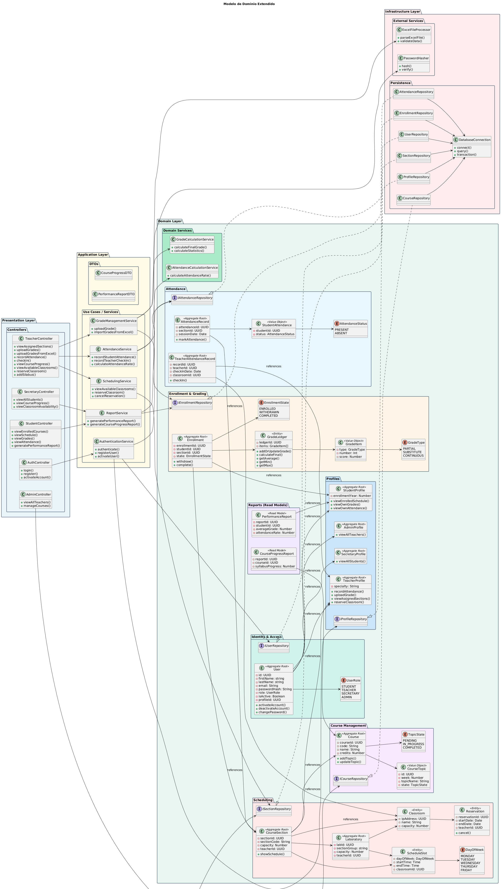

# SIS_ACAD

## TODO

- Agregar campos específicos a secretary, admin
- Controllers
- Agregar paths
- De yapa algo de interactuar con BD????
- Actualizar funciones relacionadas a requerimientos(servicios)

Steps to run this project:

1. Run `npm ci` command
2. Run `npm start` command

## Datos inciales/Seeding

```bash
npm run-script db:reset
```

## API Testing

### Auth

```bash
curl -X POST http://localhost:3000/api/v1/auth/login \
-H "Content-Type: application/json" \
-d '{
  "email": "jparedesma@unsa.edu.pe",
  "password": "jose.paredes.20024030"
}'
```

```bash
curl -X POST http://localhost:3000/api/v1/auth/login \
-H "Content-Type: application/json" \
-d '{
  "email": "jparedesma@unsa.edu.pe",
  "password": "123"
}'
```

### Secretary All Students

```bash
curl -X POST http://localhost:3000/api/v1/secretary/students \
-H "Content-Type: application/json" \
-d '{
  "page": 2,
  "pageSize": 10
}'
```

### Alumno

#### Horario

<http://localhost:3000/api/v1/student/20230099/schedule>

#### Cursos matriculados

<http://localhost:3000/api/v1/student/20230099/courses>

### Docente

#### Horario

<http://localhost:3000/api/v1/teacher/12/schedule>

#### Cursos enseniados

<http://localhost:3000/api/v1/teacher/12/courses>

## Modelo dominio extendido


